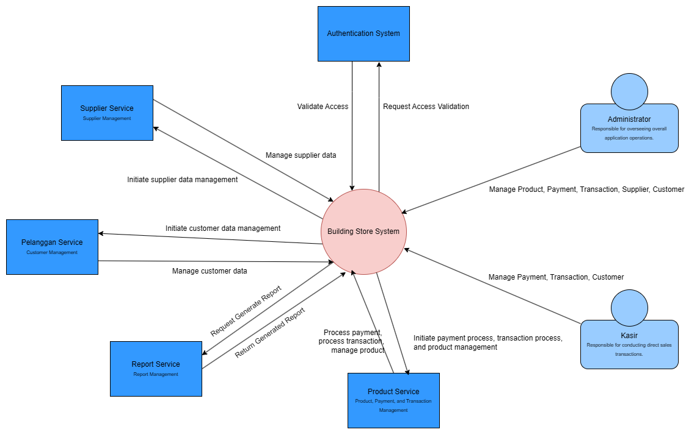

# AdvProg-Module 9 Tutorial B
Module 9 Advance Programming 2024/2025

## Deliverable G.1
### Context Diagram

### Container Diagram

### Deployment Diagram

### Future Context Diagram

### Future Container Diagram

### Risk Analysis & Architecture Modification Justification
Pada arsitektur yang sekarang terdapat beberapa risiko/kekurangan yang terdapat pada aplikasi. Risiko yang pertama adalah arsitektur yang bersifat *monolith* parsial akibatnya terdapat *coupling* yang tinggi antar modul yang bersangkutan. Akibat *coupling* tersebut perubahan satu modul dapat memicu bug di modul lainnya dan jika ingin dilakukan *scaling* maka ketiga modul tidak dapat di-*scale* terpisah. Risiko ini kami klasifikasikan sebagai menengah-tinggi karena dalam jangka panjang jika terdapat banyak pengguna dan kode perlu diperluas maka baru timbul masalah yang berkaitan.

Risiko yang kedua adalah tidak adanya modul untuk reporting atau analitik. Akibat dari risiko ini adalah info-info mengenai laporan penting, seperti penjualan atau pembayaran tidak tersedia. Selain itu untuk kepentingan bisnis, diperlukan analisis agar bisnis dapat berkembang. Risiko ini kami klasifikasikan sebagai risiko menengah.

Risiko yang ketiga adalah tidak adanya sistem *asynchronous message queue*. Saat ini semua komunikasi antar layanan dilakukan secara *synchronous* REST yang menambahkan latensi aplikasi dan meningkatkan terjadinya *failure propagation*. Risiko ini kami klasifikasi menenagah karena untuk aplikasi yang tidak besar, latensi tidak akan terpengaruhi secara banyak.

Pada *future architecture* kami menambahkan modul **Report Service** yang diharapkan dapat meningkatkan kemampuan analitik dan pelaporan sistem keseluruhan aplikasi. Perubahan ini memitigasi risiko 2 secara langsung. Dengan ini, data laporan mengenai penjualan, pembayaran, produk, dll dapat diolah secara terpusat. Selain itu modul ini juga mengandung fitur-fitur untuk menganalisis kinerja bisnis yang dapat membantu pembuatan keputusan bisnis. Lalu dengan modul ini, setiap modul tidak perlu melakukan loggingnya tersendiri, melainkan dapat diserahkan terhadap modul ini secara keseluruhan (asalkan implementasi benar).

---
### Pelanggan Service
> Ahmad Dzulfikar As-Shavy - 2306152374
#### Component Diagram

#### Code Diagram

---
### Product Service - Transaksi
> Siti Shofi Nadhifa - 2306152172
#### Component Diagram

#### Code Diagram

### Product Service - Payment
> Mirfak Naufal Pratama Putra - 2306244961
#### Code Diagram

### Product Service - Product
> Raja Rafael Pangihutan Sitorus - 2306244923
#### Component Diagram

#### Code Diagram

---
### Supplier Service
> Edmond Christian - 2306208363
#### Component Diagram

#### Code Diagram

---

Task distribution:
- Context Diagram (Deliverable G.1): Siti Shofi Nadhifa
- Container Diagram (Deliverable G.1): Raja Rafael Pangihutan Sitorus
- Deployment Diagram (Deliverable G.1): Mirfak Naufal Pratama Putra
- Future Context and Container Diagram (Deliverable G.2): Ahmad Dzulfikar As-Shavy
- Risk Analysis and Architecture Modification Justification (Deliverable G.3): Edmond Christian
